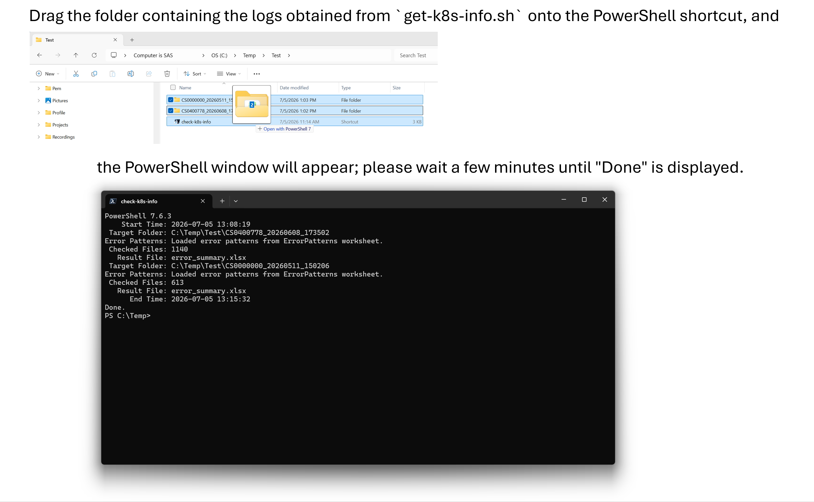
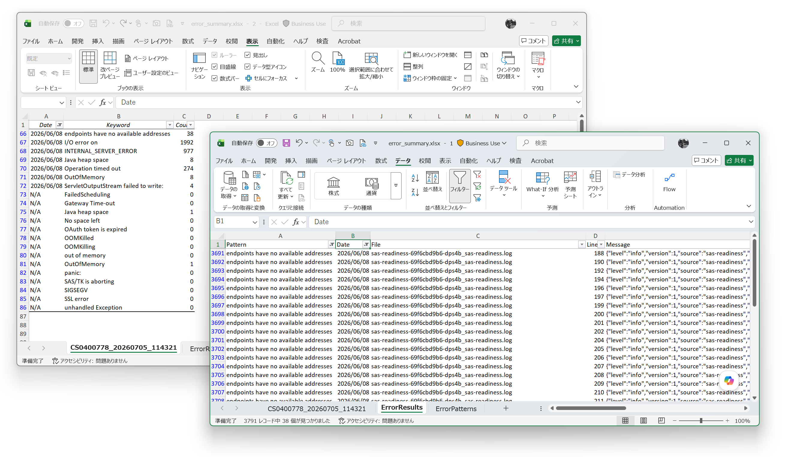

# check-k8s-info.ps1

## Overview

`check-k8s-info.ps1` is a PowerShell script for SAS Viya administrators and support engineers.

The script helps review get-k8s-info.sh log collection generated by `get-k8s-info.sh` by searching log files for known error patterns and organizing the findings into an Excel workbook.

## What the Script Does

1. Read log files collected by get-k8s-info.sh.
2. Search log files for predefined error patterns.
3. Collect matching log entries.
4. Summarize the findings in an Excel workbook.

## Features

- Analyze one or more get-k8s-info.sh log collection in a single run.
- Detect common issues using customizable error patterns.
- Export analysis results to a single Excel workbook.
- Create a drag-and-drop shortcut automatically for easier execution.

## Quick Start

1. Create a working folder.
2. Save `check-k8s-info.ps1` and the Excel `_template.xlsx` file in the folder.
3. Right-click `check-k8s-info.ps1` and select Run with PowerShell to create a shortcut.
4. A shortcut will be created automatically.
5. Drag and drop one or more get-k8s-info.sh log folders onto the shortcut.
6. Review the generated Excel workbook.

{width=80%}

---

## Output Example

The generated Excel workbook includes:

- A summary of detected error patterns
- Detection dates and occurrence counts for each pattern
- Matching log entries for further investigation

## Customize Error Patterns

By default, error patterns are defined in the PowerShell script. You can customize the patterns by editing the `$errorPatterns` array defined at the script.

To override the default patterns, add your own patterns to the `ErrorPatterns` worksheet of `_template.xlsx`. Enter one pattern per row starting from cell A1, without a header row.

Pattern matching is case-sensitive.

- SIGSEGV  
- OOMKilled  
- OutOfMemory  
- out of memory  
- Java heap space  
- panic  
- JobExecutionException  
- unhandled Exception  
- SSL error  
- SAS/TK is aborting  
- OAuth token is expired  
- OOMKilling  
- Operation timed out  
- INTERNAL_SERVER_ERROR  
- I/O error on
- No left space
- endpoints have no available addresses
- FailedScheduling

---

## Change Log

### Version 1.3 (05-Jul-2026)

- Added support for maintaining custom error patterns in the Excel template file.
- Consolidated analysis results into a single Excel workbook.
- Improved messages and user guidance.
- Added automatic shortcut creation for drag-and-drop execution.
- Optimized error pattern matching to reduce processing time.

### Version 1.2 (29-Apr-2026)

- You can now run the script by dragging and dropping one or more folders onto a shortcut.
- To handle Excel Sensitive Label restrictions, the script now uses a template Excel file.
- Added a new error check keyword: "No left space".

### Version 1.1 (30-Sep-2025)

- The format of error_result.txt was reordered to make it easier to search for items in the editor.
- Sheet names in Excel files are now taken from the contents of get-k8s-info.log.

### Version 1.0 (25-Aug-2025)
- Initial release
